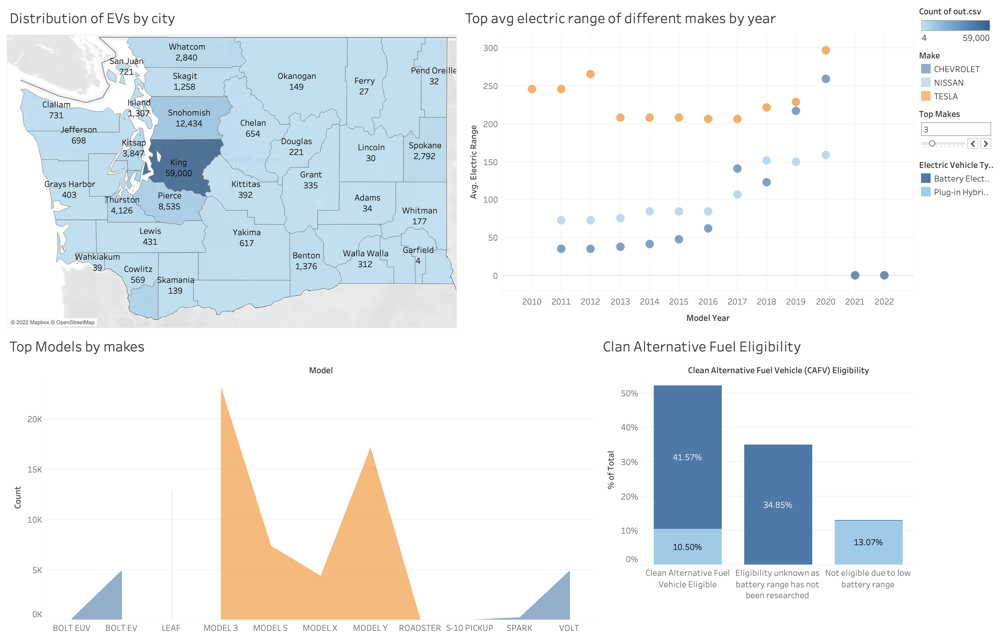

# EDA of Electric Vehicle Population Data

## Overview
Following dataset shows the Battery Electric Vehicles (BEVs) and Plug-in Hybrid Electric Vehicles (PHEVs) that are currently registered through Washington State Department of Licensing (DOL).
## Description
Pre-processing and analysis of the electric vehicle population dataset. The dataset contains information on the number of people who use electric vehicles in various USA states.

## [Dashboard](https://public.tableau.com/app/profile/aakansha.goyal/viz/ElectricVehiclePopulationinWashington/ElectricVehiclePopulationinWashington)

### [Data Source](https://catalog.data.gov/dataset/electric-vehicle-population-data)
 